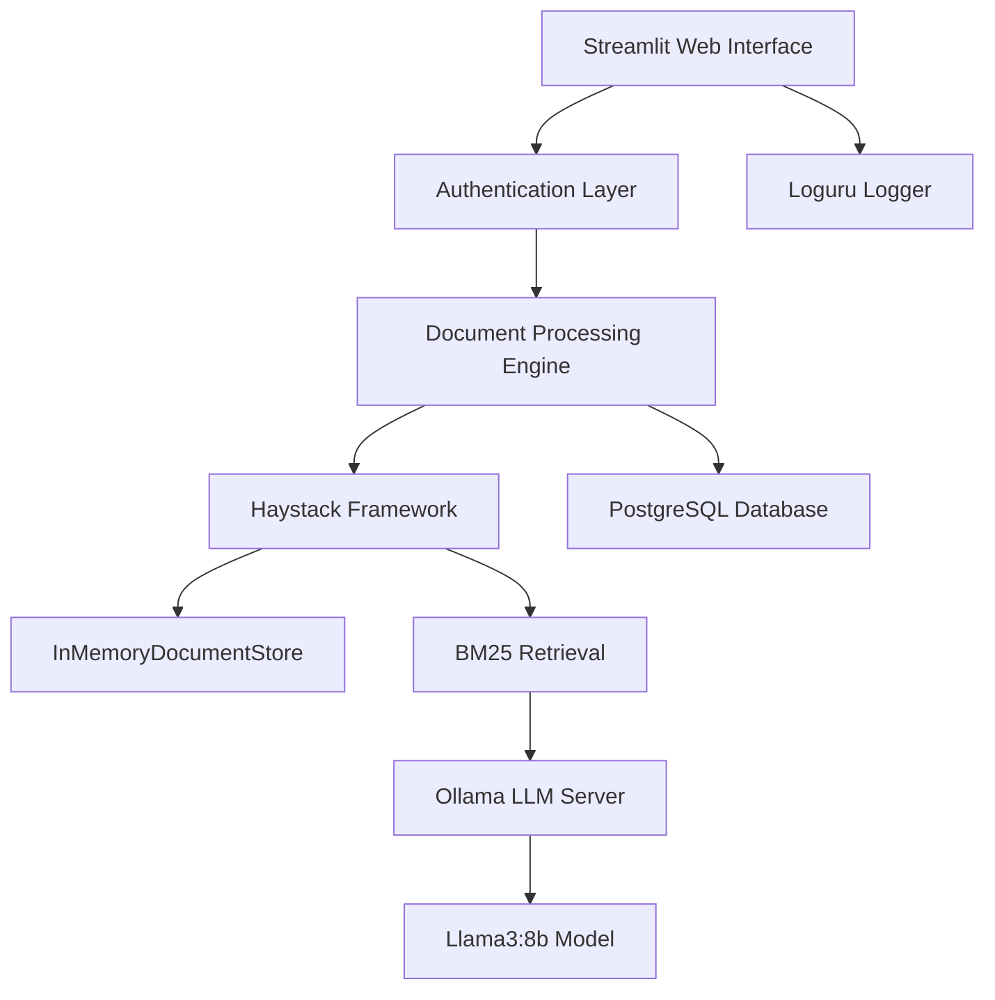

# 🤖 Llama3 RAG System

> A powerful Retrieval-Augmented Generation application combining the intelligence of Llama3:8b with modern document retrieval capabilities

[](https://python.org)
[](https://streamlit.io)
[](https://ollama.ai)
[](https://postgresql.org)

## ✨ Features

- 🔐 **Secure Authentication** - Password-protected web interface
- 📚 **Smart Document Processing** - Advanced text chunking and indexing with Haystack
- 🎯 **Intelligent Retrieval** - BM25-powered document search for relevant context
- 🦙 **Local LLM Power** - Llama3:8b model running entirely on your infrastructure
- 💾 **Persistent Storage** - PostgreSQL database for reliable data management
- 🔍 **Real-time Logging** - Comprehensive application monitoring with Loguru
- 🎨 **Intuitive Interface** - Clean, responsive Streamlit web application

## 🏗️ Architecture



### Core Components

| Component | Technology | Purpose |
|-----------|------------|---------|
| **Frontend** | Streamlit | Interactive web interface with authentication |
| **Document Engine** | Haystack | Advanced document processing and retrieval |
| **Retrieval System** | BM25 + InMemoryDocumentStore | Fast, accurate document matching |
| **Language Model** | Ollama + Llama3:8b | Local LLM for response generation |
| **Database** | PostgreSQL | Persistent data storage and management |
| **Logging** | Loguru | Comprehensive application monitoring |

## 🚀 Quick Start

### Prerequisites

- Python 3.8+
- PostgreSQL 13+
- Ollama installed and running
- Llama3:8b model pulled in Ollama

### Installation

1. **Clone the repository**
   ```bash
   git clone <your-repo-url>
   cd llama3_rag_setup
   ```

2. **Install dependencies**
   ```bash
   pip install -r requirements.txt
   ```

3. **Set up Ollama**
   ```bash
   # Install Ollama (if not already installed)
   curl -fsSL https://ollama.ai/install.sh | sh
   
   # Pull Llama3:8b model
   ollama pull llama3:8b
   
   # Start Ollama server
   ollama serve
   ```

4. **Configure PostgreSQL**
   ```bash
   # Create database and configure connection settings
   createdb rag_database
   ```

5. **Launch the application**
   ```bash
   streamlit run llama3_rag_setup/scripts/main.py
   ```

## 📁 Project Structure

```
llama3_rag_setup/
├── scripts/
│   └── main.py              # 🎯 Main Streamlit application
├── logs/
│   └── app.log             # 📝 Application logs
├── requirements.txt        # 📦 Python dependencies
└── README.md              # 📖 This file
```

## 🔧 Configuration

The application uses environment variables and configuration files for setup:

- **Database Connection**: Configure PostgreSQL settings
- **Ollama Settings**: Default connection to `localhost:11434`
- **Authentication**: Set password in application settings
- **Logging Level**: Configurable via Loguru settings

## 🎯 Usage

1. **Access the Web Interface**: Navigate to `http://localhost:8501`
2. **Authentication**: Enter your password to access the system
3. **Upload Documents**: Add your documents for processing
4. **Query System**: Ask questions and get AI-powered answers with relevant context
5. **View Results**: See retrieved documents and generated responses

## 🛠️ Technical Details

### Document Processing Pipeline
1. **Text Extraction** → **Chunking** → **Indexing** → **Storage**

### Retrieval Process
1. **Query Processing** → **BM25 Search** → **Context Retrieval** → **LLM Generation**

### Performance Optimizations
- In-memory document store for fast retrieval
- Efficient text chunking strategies
- Optimized PostgreSQL queries
- Local LLM inference for privacy and speed

## 📊 Monitoring & Logs

All application activities are logged to `logs/app.log` with different severity levels:
- ✅ **INFO**: Normal operations
- ⚠️ **WARNING**: Potential issues
- ❌ **ERROR**: System errors
- 🔍 **DEBUG**: Detailed debugging information

## 🤝 Contributing

Contributions are welcome! Please feel free to submit issues, feature requests, or pull requests.

## 📄 License

This project is licensed under the MIT License - see the [LICENSE](LICENSE) file for details.

## 🆘 Support

For questions, issues, or support:
- Create an issue in the repository
- Check the logs at `logs/app.log` for troubleshooting
- Ensure all dependencies are properly installed

---

*Built with ❤️ using Llama3, Haystack, and Streamlit*
